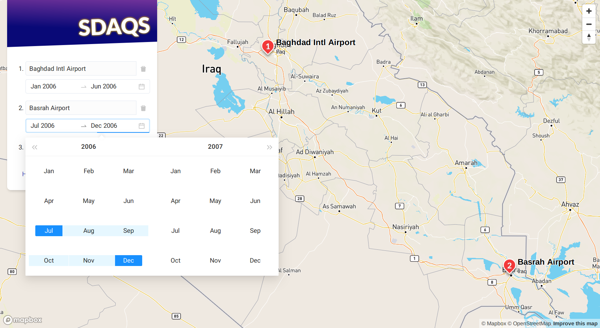

<h1>
  
  SDAQS-SADA
  
</h1>

This _Source-Differentiated Air Quality System
for Southwest Asia, Djibouti, and Afghanistan_
is an air quality reporting tool built for
[U.S. federal grant 80NSSC19K0225][0]
and funded by the NASA Shared Services Center.



Generate a time series **chart** and **downloadable CSV file** of air pollution concentrations
for over 1,200 military bases throughout Southwest Asia,
broken down by month, for any period from 2002 to present.

SDAQS-SADA reports individual concentration levels
for fine particulate matter (PM2.5) mass and components,
including sulfate, nitrate, elemental carbon, organic carbon, and dust.

### Associated Programs

* **Clinical:** Department of Veterans’ Affairs [CSP #595][1]


### Project Team

* <a href="https://www.statistics.utoronto.ca/people/directories/all-faculty/meredith-franklin" target="_blank">Meredith Franklin</a>, Ph.D. (University of Toronto & University of Southern California)
* Petros Koutrakis, Ph.D. (Harvard University)
* Eric Garshick, M.D. (VA Boston Healthcare & Harvard Medical School)
* Olga Kalashnikova, Ph.D. (Jet Propulsion Laboratory)
* Joel Schwartz, Ph.D. (Harvard University)
* Harvard School of Public Health Environmental Chemistry Lab

Deployment
----------

Requires Docker Compose.

<a href="https://docs.docker.com/">
  </a>
<a href="https://docs.docker.com/compose/">
  </a>

```sh
# download the repo
$ git clone https://github.com/rlue/sdaqs-sada
$ cd sdaqs-sada

# setup
$ mv path/to/db_seed.sql data/
$ export MAPBOXGL_ACCESS_TOKEN="pk.eyJ1Ijoicmx..."

# (re-)deploy
$ docker-compose up -d --build
```

The resulting container will expose the service at <http://localhost:9292>.

(Learn more about the setup steps in
[Installing Non-Public Data](#installing-non-public-data)
and [Security Notice](#security-notice) below.)

Deploying to the public Internet and enabling HTTPS
are beyond the scope of this README.
For help with these tasks,
consider a reverse proxy or edge router like [traefik][].

### Installing Non-Public Data

This application depends on air quality exposure data derived through published research that can be found <a href="https://www.sciencedirect.com/science/article/pii/S0160412021000702" target="_blank">here</a> and <a href="https://www.mdpi.com/2073-4433/13/2/255" target="_blank"> here </a>.
Data shown in this application cannot be distributed publicly,
as they reference the geo-coordinates of various US military bases. Please contact the <a href="https://www.statistics.utoronto.ca/people/directories/all-faculty/meredith-franklin" target="_blank">PI</a> for access to gridded data.

Before the application can be deployed,
you will need to obtain a SQL dump of this data from the project team
and save it to `data/db_seed.sql`.

### Security Notice

This application requires a Mapbox access token.
Get one at <https://account.mapbox.com>.

<a href="https://account.mapbox.com">
  </a>

Deploying this application will expose this token
to anyone who can access the site—it’s not shown in the open,
but a determined attacker shouldn’t have a hard time finding it.

Typically, that’s Not a Good Thing,
since anyone who obtains your token can use it in their own software
and eat into your monthly usage allowance
(or worse yet, rack up a big bill on a pay-as-you-go plan).
But in this case, it’s just a necessary consequence
of using a JavaScript library ([Mapbox GL JS][]) to access a third-party API:
the client-side application can’t query for map data without the token,
so it must be present in the compiled JS file.

Fortunately, Mapbox has a generous free tier,
so the likelihood of abuse is low.
For more on access token best practices,
read [How to use Mapbox securely][].

Development
-----------

SDAQS-SADA is built using Roda + React.

<a href="https://roda.jeremyevans.net">
  </a>
<a href="https://reactjs.org">
  </a>

### Requirements

* Ruby 2.7.2
* Bundler 2.1.4
* npm 6.0+
* PostgreSQL
* [forego][2]
* [direnv][3] (recommended)

### Configuration

```sh
# .envrc (for direnv)
export RACK_ENV="development"
export NODE_ENV="development"
export APP_DATABASE_URL="postgres:///sdaqs_${RACK_ENV}"
export MAPBOXGL_ACCESS_TOKEN="pk.eyJ1Ijoicmx..." # get one at account.mapbox.com

# .git/config
[core]
	hooksPath = .git-hooks
```

### Common Tasks

```sh
# install dependencies
$ bundle install
$ npm install

# set up database
$ createdb sdaqs_development
$ dropdb sdaqs_development
$ rake db:seed

# generate confidential frontend assets
# (required for compilation of frontend app)
$ rake secrets:generate  # or rake secrets:g

# launch ruby console
$ rake console  # or rake c

# launch in development mode
$ rake server   # or rake s
```

### Fonts

To embed new fonts into this project:

1. [Convert][4] to WOFF/WOFF2 format
2. Save to `public/assets/fonts`
3. Use the [CSS `@font-face` directive][5]

### Git Commit Message Codes

This repo follows a pattern for git commit messages
inspired by [the one used on AngularJS][6].

The first line of each commit should begin
with one of the following three-letter codes:

* `bfx`: Bugfix
* `chr`: Chore (deprecated, try `dev` or `dep`)
* `dep`: Dependency (_i.e.,_ Bundler/npm files)
* `dev`: Developer Concerns (notes, tooling, file structure, etc.)
* `doc`: Documentation
* `dpl`: Deployment
* `ftr`: Feature
* `rfg`: Refactoring
* `tdd`: Testing
* `uix`: UI/UX
* `vis`: Visual Design

License
-------

Copyright © 2022 University of Southern California. All rights reserved.

[0]: https://govtribe.com/award/federal-contract-award/grant-for-research-80nssc19k0225
[1]: https://www.vacsp.research.va.gov/CSPEC/Studies/INVESTD-R/CSP-595-SHADE.asp
[2]: https://github.com/ddollar/forego/releases
[3]: https://github.com/direnv/direnv
[4]: https://www.fontsquirrel.com/tools/webfont-generator
[5]: https://css-tricks.com/snippets/css/using-font-face/
[6]: https://docs.google.com/document/d/1QrDFcIiPjSLDn3EL15IJygNPiHORgU1_OOAqWjiDU5Y
[traefik]: https://docs.traefik.io
[Mapbox GL JS]: https://docs.mapbox.com/mapbox-gl-js/overview/
[How to use Mapbox securely]: https://docs.mapbox.com/help/troubleshooting/how-to-use-mapbox-securely/
